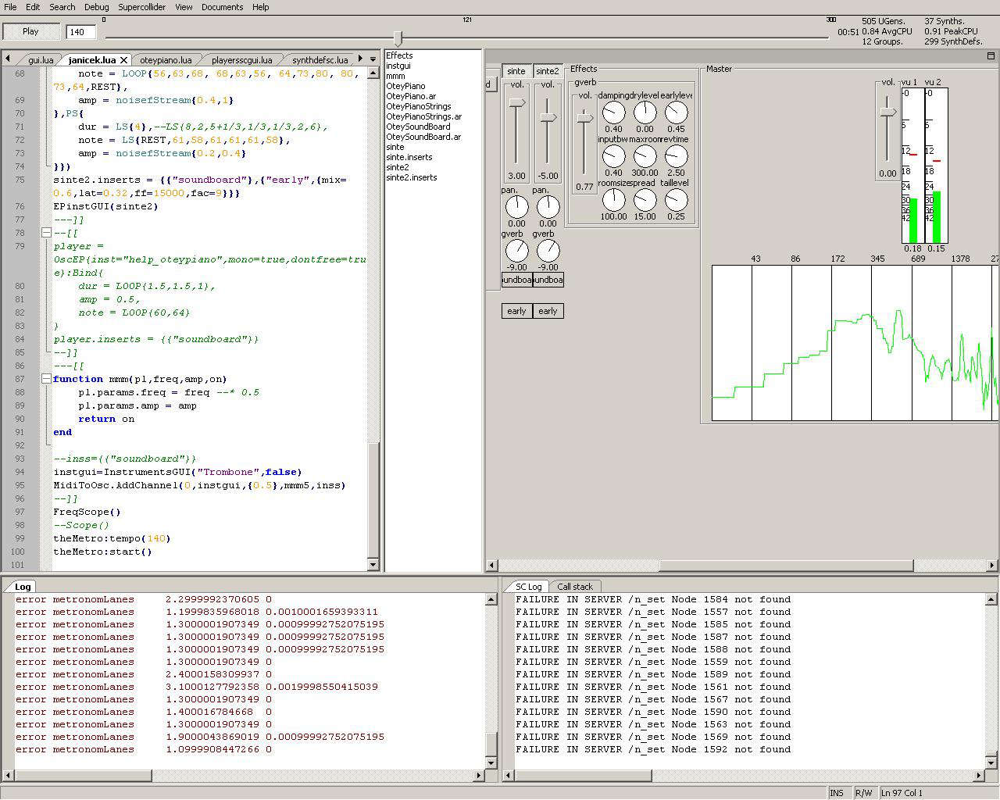

Lua2SC
======

Lua client for supercollider scsynth and supernova.
Pure lua implementation based on standard portable modules: lualanes, wxlua, luasocket, bitOp 
plus some custom modules: osclua, pmidi, random.

------Linux and Mac OS-----------

First you should build lua 5.1 or 5.2
build lualanes ()
build wxlua as a module (most difficult part)
build luasocket
build bitOp (in case you are in 5.1)

Then build this repo:
with CMake you need to provide:

PORTMIDI_DIR with path to portmidi
OSCPACK_DIR with path to oscpack (1_1_0 or greater)
LUA_INCLUDE_DIR with the lua source include directory
LUA_LIBRARY with the path to lua.dll

------Windows--------

windows users can try the already build binary folder Lua2SC-bin

--------------To first try---------------------

run lua lua2sc.lua

1- set Debug/settings
2- Supercollider/BootSC (wait until booted)
3- open lua/examples/example.lua
4- Debug/run  (F6)
5- Debug/Cancel run (F5)

